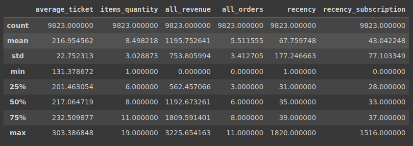
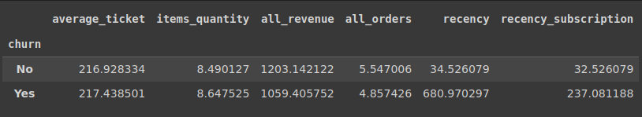
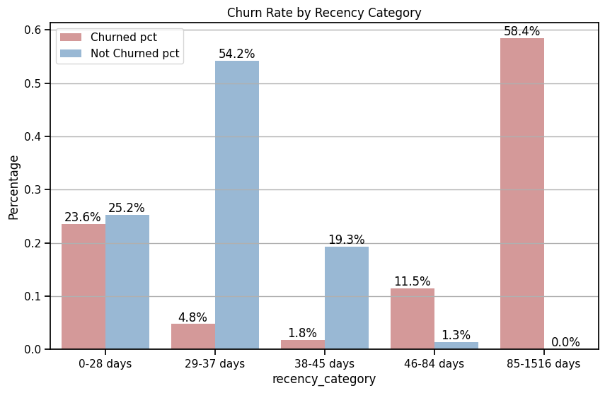
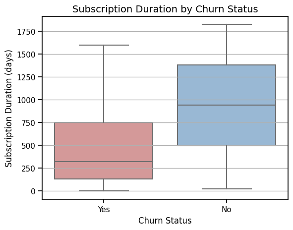

# Churn Analysis
Repositório: https://github.com/wewerthonc/churn-analysis

Original: https://colab.research.google.com/drive/1HMHLvDkqChgJUFPj-5Iw7-vpHcfca8ud.
- Google colab notebook: **Churn_data_analysis.ipynb.ipynb**
- Dataset: data\data-test-analytics.csv


<p align="justify">
Neste notebook, montamos o Google Drive, importamos pacotes necessários como matplotlib, seaborn, numpy e pandas, e lemos um arquivo CSV chamado "data-test-analytics.csv", que contém dados de churn de clientes.
</p>

# 1. Introduction

<p align="justify">
Estou participando de um desafio para uma vaga de estágio. A empresa em questão, especializada em serviços de assinaturas, está enfrentando um problema de aumento no índice de "Churn", ou seja, clientes que assinam o serviço e o cancelam em algum momento posterior. A equipe de assinaturas tem como objetivo reduzir essa perda de assinantes, porém, mesmo com melhorias na plataforma, o churn vem aumentando nos últimos meses. Nesse contexto, será realizada uma análise de dados com o objetivo de identificar os fatores que levam à perda de assinantes e propor soluções o problema.
</p>


# 2. Data Description

<p align="justify">
Como dito previamente, o dataset contém informações de assinaturas de clientes. Cada linha do dataset representa um cliente e este possui 10000 linhas. Cada coluna significa uma característica do cliente, sendo as seguintes colunas:
</p>

- id: Identificação do cliente
- created_at: Data de criação da assinatura
- updated_at: Data da última modificação da assinatura
- deleted_at: Data de cancelamento da assinatura
- name_hash: Nome do usuário criptografado
- email_hash: E-mal do usuário criptografado
- address_hash: Endereço do usuário criptografado
- birth_date: Data de aniversário do cliente
- status: Status da assinatura
- version: Versão da assinatura
- city: Cidade do cliente
- state: Estado do cliente
- neighborhood: Bairro do cliente
- last_date_purchase: Data do último pedido que ocorreu pela assinatura
- average_ticket: Média de gasto por pedido
- items_quantity: Média de itens na assinatura
- all_revenue: Total de receita realizado pelo cliente
- all_orders: Total de pedidos realizado pelo cliente
- recency: Tempo desde a última compra do cliente
- marketing_source: Canal de marketing que converteu a assinatura

<p align="justify">
Serão usadas todas as colunas para a análise, com exceção das colunas name_hash, email_hash e address_hash, visto que não são importantes para análise.
</p>

<p align="justify">
Logo no início, é necessário definir as colunas que contêm dados do tipo data, pois pode ajudar a evitar erros e aumentar a precisão das análises.
</p>

```python
# Define the column names to convert to date
date_cols = ['created_at', 'updated_at', 'deleted_at', 'birth_date', 'last_date_purchase']

# Read the CSV file and convert specified columns to datetime
churn_df = pd.read_csv(PATH_BASE + "data-test-analytics.csv", usecols = cols, parse_dates = date_cols)
```
<p align="justify">
Dessa forma, assim ficará o dataset. Note que há valores 'null' para a coluna 'deleted_at'. Obviamente, clientes ativos não contém uma data de cancelamento da assinatura.
</p>

<p align="center">
  
</p>

# 3 Data Clearning

<p align="justify">
Um dos primeiros passos na limpeza de dados, é a contagem de valores nulos por coluna. Com essa informação, conhecemos mais sobre o dataset e podemos decidir como manipular os dados. Da mesma forma, ajuda a evitar erros nas análises que virão.
</p>

<p align="center">
  
</p>

#### Data out of range

<p align="justify">
Nas análises a serem realizadas, é importante que tenhamos valores consistentes. No mundo real, é impossível alguém nascer no futuro, assim como alguém não pode comprar uma quantidade negativa de itens. O código abaixo seleciona as colunas que contêm datas e as colunas numéricas. Para as colunas com datas, é verificado a quantidade de valores no futuro e para as colunas numéricas e verificado a quantidade de valores negativos.
</p>

```python
from datetime import date

# Check for out of range values in datetime columns
date_cols = churn_df.select_dtypes(include = ['datetime64']).columns
for col in date_cols:
    num_out_of_range = len(churn_df[churn_df[col].dt.date > date.today()])
    print(f"Number of '{col}' rows out of range: {num_out_of_range}")

# Check for negative values in numeric columns
num_cols = churn_df.select_dtypes(include = ['int64', 'float64']).columns
for col in num_cols:
    num_negative = len(churn_df[churn_df[col] < 0])
    print(f"Number of '{col}' rows out of range: {num_negative}")
```
<p align="center">
  
</p>

<p align="justify">
Por meio dos resultados, é possível perceber bastante valores incorretos para a coluna 'birth_date'. A quantidade representa mais de 50% dos valores contidos na tabela. Sendo assim, é importante excluir essa coluna do dataset, uma vez que não irá nos ajudar a tirar conclusões sobre o problema.
</p>


#### Duplicated Data

<p align="justify">
Outra verificação muito importante quando estamos limpando os dados, é a contagem de valores duplicados. Se tivessemos o mesmo cliente duplicado centenas de vezes no nosso dataset, poderiamos tirar conclusões enviesadas sobre o nosso problema. Portanto, não seria uma situação agradável. Essa verificação pode acontecer de várias formas. Porém, é sempre necessário olharmos para valores duplicados considerando todas as colunas e para a coluna que deveria ter um valor único, muitas vezes chamada de chave primária.
</p>

```python
# Drop duplicates across all columns
churn_df.drop_duplicates(inplace = True)

# Drop duplicated rows that have the same id
churn_df.drop_duplicates('id', inplace = True)
```

#### Inconsistent Data

<p align="justify">
Pode haver diversas inconsistências nos nossos dados. Muitas vezes, os dados podem estar corrompidos, incompletos ou imprecisos. Essas inconsistências podem afetar a qualidade da análise e gerar resultados errados ou distorcidos. No nosso dataset, podemos observar que temos várias colunas representado datas. Com base nessas datas, podemos chegar a seguinte afirmação: um dado da coluna 'created_at' não deve ser maior que um dado da coluna 'updated_at', assim como não deve ser maior que um dado da coluna 'deleted_at'. Um cliente não pode ser criado depois de deletado ou atualizado. Da mesma forma, um dado da coluna 'last_date_purchase' não pode estar no futuro, ter acontecido antes do cliente ser sido criado ou depois do cliente ter sido deletado.
</p>

```python
# Define a mask to filter the rows based on the following conditions:
# 1. 'created_at' should be less than or equal to 'updated_at'
# 2. 'created_at' should be less than or equal to 'deleted_at'
# 3. 'created_at' should be less than or equal to 'last_date_purchase'
# 4. 'last_date_purchase' should be less than or equal to 'deleted_at' (if it exists)
#    Otherwise, it should be less than or equal to the current date and time

mask = (churn_df['created_at'] <= churn_df['updated_at']) & \
        (churn_df['created_at'] <= churn_df['deleted_at'].fillna(pd.Timestamp.now())) & \
        (churn_df['last_date_purchase'] <= churn_df['deleted_at'].fillna(pd.Timestamp.now())) & \
        (churn_df['created_at'] <= churn_df['last_date_purchase'])

# Filter the churn data using the mask and update the churn data with the filtered data
consistent = churn_df[mask]
inconcistent = churn_df[~mask]
```

<p align="justify">
Ao todo foram encontrados 177 valores inconsistentes. Felizmente, é um número pequeno. Agora, devemos excluir os clientes com esses valores ou atualiza-los?! O que aconteceria se todos esses valores inconsistentes fossem de clientes que cancelaram a assinatura?! Isso tornaria a nossa análise muito mais difícil. Visto que, como visto anteriormente, somente 505 possuem possuem data de cancelamento. Perderiamos a representação desses clientes. Por isso, é importante analisar quais são as classes contidas nesses dados inconsistentes. Por meio da coluna 'status', é possível ver essa informação.
</p>

<p align="center">
  
</p>

<p align="justify">
Como nenhum dos clientes são clientes que cancelaram a assinatura, podemos retirá-los do dataset sem perda de informação.
</p>

#### Cross-validation

<p align="justify">
Não, não estamos falando de machine learning. Cross-validation, no contexto de limpeza de dados, significa juntar informações de algumas colunas para verificar a consistência do valor de outra coluna. No nosso dataset, por meio da colunas 'average_ticket' e 'all_orders', é possível conseguir o valor da coluna 'all_revenue'. Assim como, com os valores da coluna 'deteled_at', é possível saber os clientes com status de cancelado na coluna 'status'.
</p>

```python
# Check if avarage ticket times all_orders is equal to all_revenue
# Take precision when multiplicating floats into account
tolerance = 0.1
mask = abs(churn_df['average_ticket'] * churn_df['all_orders'] - churn_df['all_revenue']) < tolerance
churn_df = churn_df[mask]
```

```python
# Select rows where 'deleted_at' column is not null
deleted_churn = churn_df[~pd.isna(churn_df['deleted_at'])]

# Select rows where 'status' column is 'canceled'
canceled_churn = churn_df[churn_df['status'] == 'canceled']

# Check if all canceled subscriptions have 'deleted_at' values
result = (deleted_churn == canceled_churn).isna().any().sum() == 0

if result:
  print("All canceled subscriptions have 'deleted_at' values")
```

<p align="justify">
A coluna 'recency' possui valores que representam o tempo desde a última compra do cliente. O que aconteceria se esses valores continuassem sendo alterados mesmo depois do cliente ter cancelado a assinatura? Caso comparássemos esses valores com clientes ativos, poderíamos chegar a falsas conclusões. Dessa forma, vamos criar uma nova coluna 'recency_subscription', que significa a quantidade de dias que um cliente está sem fazer uma compra, levando em consideração somente o tempo de assinatura. A data da compra mais nova no dataset será usada como referência para fazer os cálculos para clientes ativos.
</p>

```python
# Create a new column that shows the time since the last purchase in the subscription
churn_df['recency_subscription'] = (churn_df['last_date_purchase'].max() - churn_df['last_date_purchase']).dt.days


# For clients who have a value in the 'deleted_at' column, calculate the difference
# between the 'deleted_at' and 'last_date_purchase' columns and use that value to
# update the coolumn 'recency_subscription'.
churn_df.loc[churn_df['deleted_at'].notnull(), 'recency_subscription'] = \
          (churn_df['deleted_at'] - churn_df['last_date_purchase']).dt.days
```

<p align="justify">
Realizamos as principais manipulações e verificações de consistência em nosso conjunto de dados, garantindo assim que ele esteja pronto para análises detalhadas que nos permitam tirar conclusões acerca dos motivos pelos quais os clientes estão cancelando suas assinaturas.
</p>

# 4 Exploratory Data Analysis

<p align="justify">
Para facilitar nossa análise, vamos criar uma nova coluna chamada 'churn' a partir da coluna 'deleted_at'. Essa coluna poderá ter dois valores: 'Yes' (Sim) caso o cliente tenha cancelado a assinatura e 'No' caso contrário. A criação dessa coluna vai simplificar a nossa visualização e permitir que possamos trabalhar com os dados de forma mais direta, sem precisar realizar muitas manipulações.
</p>

```python
# Create a new column to address churned clients
churn_df['churn'] = pd.isna(churn_df['deleted_at']).apply(lambda deleted: "Yes" if not deleted else "No")
```

<p align="justify">
Primeiramente, é importante visualizar comos as nossas classes estão distribuidas no nosso dataset, visto que elas são o foco principal da nossa análise.
</p>

```python
churn_counts = churn_df['churn'].value_counts()

# Define colors for each category
colors = ['#8FB8DE', '#DE8F8F']

# Create the pie chart
plt.figure(figsize=(6,6))
plt.pie(churn_counts, 
        labels = churn_counts.index, 
        colors = colors, 
        # Use a lambda function to format the percentage and count labels
        autopct = lambda x: f'{x:.2f}%\n({x/100.*sum(churn_counts):.0f})', 
        startangle = 90, 
        textprops = {'fontsize': 14})
plt.title('Churn Distribution: Percentage and Count of Customer Churn', 
          fontsize = 16, 
          fontweight = 'bold', 
          # Move the title above the chart to prevent overlap
          y=1.05)
plt.legend(title = 'Class', 
           loc = 'best', 
           labels = churn_counts.index, 
           fontsize = 12)
plt.axis('equal')
plt.tight_layout()
plt.show()
```

<p align="center">
  
</p>

<p align="justify">
Como podemos visualizar, há um número bem menor de clientes que cancelaram a assinatura. Sendo assim, a representatividade dos clientes pode ser considerada limitada, pois há poucas amostras, podendo trazer um viés para a nossa análise. Uma das primeiras análises de dados que se deve realizar é a descrição estatística dos dados númericos. Esse procedimento é fundamental porque nos permite descrever os dados de maneira completa e direcionar a análise de forma coerente.
</p>

<p align="center">
  
</p>

<p align="justify">
Os valores apresentados na imagem, sugerem um dataset com valores dispersos igualmente, com exceção das colunas  'recency' e 'recency_subscription', onde o resultado sugere que pode haver valores discrepantes (outliers) em nosso conjunto de dados, pois apresentam valores máximos muito acima dos valores típicos de cada coluna. Outilers são valores que se afastam significativamente da média dos dados. É importante tratar os outliers porque eles podem afetar significativamente a análise de dados e levar a conclusões enviesadas.
</p>


<p align="justify">
Com base nessa na nova coluna 'churn', é possível calcular novas estatísticas descritivas para as colunas numéricas de cada categoria presente nessa coluna. Dessa forma, podemos identificar possíveis diferenças estatísticas entre as diferentes categorias.
</p>

```python
churn_df.groupby('churn').mean(numeric_only = True)
```

<p align = "center">
  
</p>

```python
churn_df.groupby('churn').std(numeric_only = True)
```

<p align = "center">
  
</p>

<p align="justify">
Analisando os resultados, podemos observar que os atributos que caracterizam os clientes que cancelaram a assinatura não apresentam uma grande variação em comparação com aqueles que permaneceram. Entretanto, nas colunas 'rencency' e 'recency_subscription', os resultados dos clientes que cancelaram a assinatura são bem maiores dos aqueles que não cancelaram. Isso pode sugerir que e o cliente ficou um longo período sem utilizar a assinatura antes de cancelar pois ele não viu vantagem em continuar pagando por algo que não está usando. Por outro lado, um cliente que mantém a assinatura ativa e não fica muito tempo sem comprar pode estar satisfeito o serviço oferecido e vê valor em continuar pagando pela assinatura. Vamos apenas considerar a coluna 'recency_subscription'.
</p>

<p align="justify">
Uma prática recomendada nesses casos é verificar se a quantidade de clientes que cancelaram aumenta à medida que os dias desde a última compra passam. Para realizar essa verificação, é possível criar uma coluna 'rencency_caregory' que divide a coluna 'recency_subscription' em grupos, levando em consideração a quantidade de dias que um cliente ficou sem realizar uma compra.
</p>

<p align="justify">
Para realizar essa tarefa em outras colunas, vamos criar duas funções. A primeira função, chamada 'create_category_column', irá gerar uma nova coluna com categorias a partir de uma coluna numérica. Essa função recebe uma lista que definirá qual intervalo dos dados cada categoria irá representar.
</p>

```python
def create_category_column(df: pd.DataFrame, numerical_col: str, cat_col: str, percentiles: List[float]):
    """
    Creates a new column in the given DataFrame that contains category labels for
    the given numerical column.

    Args:
        df (pd.DataFrame): A pandas DataFrame containing the numerical column to be categorized.
        numerical_col (str): The name of the column containing the numerical values to be categorized.
        cat_col (str): The name of the column to be created that will contain category labels.
        percentiles (List[float]): A list of percentiles to calculate quantiles and bins.

    Returns:
        pd.DataFrame: The input DataFrame with the new category column.
    """
    # Define quantiles and bins based on percentiles
    quantiles = list(df[numerical_col].quantile(percentiles))
    bins = [-1] + quantiles

    # Define labels for each category
    labels = []
    for i in range(len(quantiles)):
        if i == 0:
          labels.append(f"0-{int(quantiles[i])} days")
        else:
          labels.append(f"{int(quantiles[i-1])+1}-{int(quantiles[i])} days")

    # Create a new column with the subscription duration category
    df[cat_col] = pd.cut(df[numerical_col], bins = bins, labels = labels)

    return df
```

<p align="justify">
A segunda função, 'plot_churn_rate_by_category', exibe um gráfico de barras mostrando a porcentagem de cada categoria em cada intervalo. Essa função usa a função 'create_category_column', dessa forma só precisaremos chamar a função 'plot_churn_rate_by_category' para realizar os trabalhos. Ela recebe um DataFrame contendo uma coluna numérica e a coluna a ser criada. A função cria categorias com base nos percentis fornecidos e plota a taxa de cancelamento (churn rate) para cada categoria.
</p>

```python
def plot_churn_rate_by_category(df: pd.DataFrame, numerical_col: str, cat_col: str, percentiles: List[float]):
    """
    Plots the churn rate by given numerical .
    Given a numerical column, create categories and plots the churn rate by each category

    Args:
        df (pd.DataFrame): A pandas DataFrame containing the numerical column to be aggregated and 'churn'.
        numerical_col (str): The name of the column containing the numerical values to be aggregated.
        cat_col (str): The name of the column containing the category to be created.
        percentiles (List[float]): A list of percentiles to calculate quantiles and define the category bins.
    Returns:
        None
    """
    # Create a new category column
    df = create_category_column(df, numerical_col, cat_col, percentiles)

    # Filter the DataFrame to include only churned and non-churned clients
    churned_df = df[df['churn'] == 'Yes']
    not_churned_df = df[df['churn'] == 'No']

    # Group the data by the given category and calculate the percentage of churned and non-churned clients in each group
    churned_pct = (churned_df.groupby(cat_col)['churn'].count() / len(churned_df))
    not_churned_pct = (not_churned_df.groupby(cat_col)['churn'].count() / len(not_churned_df))

    # Merge the percentages for churned and non-churned clients into a single DataFrame
    pct_df = pd.concat([churned_pct, not_churned_pct], axis=1).reset_index()
    pct_df.columns = [cat_col, 'Churned pct', 'Not Churned pct']

    # Melt the DataFrame to create
    melted_df = pct_df.melt(id_vars = cat_col, var_name = 'churned', value_name = 'percent')

    # Create the bar plot
    plt.figure(figsize=(10, 6))
    ax = sns.barplot(x= cat_col, y = 'percent', hue = 'churned', data = melted_df)

    # Add horizontal grid lines
    plt.grid(axis = 'y' )

    # Add percentage annotations to the bars
    for p in ax.containers:
        for q in p.patches:
            x = q.get_x() + q.get_width() / 2
            y = q.get_height()
            ax.annotate('{:.1%}'.format(y), (x, y), ha = 'center', va = 'bottom')

    # Set the x and y labels
    ax.set_xlabel(f'{cat_col}')
    ax.set_ylabel('Percentage')

    # Set the title
    ax.set_title(f'Churn Rate by {cat_col}')

    legend = ax.get_legend()
    legend.set_title("")

    # Show the plot
    plt.show()
```
<p align="justify">
Agora podemos criar a coluna 'recency_category'. Iremos passar para a função o intervalo, o nome da coluna 'recency_subscription' e o nome da coluna a ser criada, bem como o nosso dataset.
</p>

```python
percentiles = [0.25, 0.75, 0.95, 0.97, 1]
plot_churn_rate_by_category(churn_df, 'recency_subscription', 'recency_category', percentiles)
```

<p align = "center">
  
</p>

<p align="justify">
Podemos concluir ao analisar o gráfico de barras que a maioria dos clientes que cancelaram a assinatura ficaram mais de 46 dias sem efetuar uma compra, sendo que quase 60% desses clientes ficaram 85 dias sem utilizar a assinatura, e não há nenhum cliente ativo com 85 ou mais dias sem comprar pela assinatura.
</p>

<p align="justify">
O tempo de assinatura pode influenciar um cliente a cancelar a assinatura. Se  não atende mais às expectativas do cliente, ele pode decidir cancelar Com os dados que temos no nosso dataset, é possível saber o tempo de assinatura de cada cliente e, portanto, definir uma coluna 'subscription_duration'.
</p>

```python
# Define a date and time.
current_time = churn_df['last_date_purchase'].max()

# Fill any missing values (if any) in the 'deleted_at' column with the defined time
deleted_at = churn_df['deleted_at'].fillna(current_time)

# Calculate the difference between the 'deleted_at' and 'created_at' columns to get the subscription duration 
subscription_duration = deleted_at - churn_df['created_at']

# Extract only the days from the subscription duration
subscription_days = subscription_duration.dt.days

# Create a new column 'subscription_duration'
churn_df['subscription_duration'] = subscription_days
```

<p align="justify">
O próximo passo é fazer uma visualização, para descobir a distribuição do tempo de assinatura comparado entre clientes que cancelaram e aqueles que não cancelaram. Um boxplot seria perfeito para essa situação.
</p>

```python
# Create boxplot
g = sns.boxplot(x = 'churn', y = 'subscription_duration', sym = "", data = churn_df)

# Add horizontal grid
g.yaxis.grid(True)

# Set labels and title
g.set_xlabel('Client Status')
g.set_ylabel('Subscription Duration (days)')
g.set_title("Subscription Duration by Churn Status", fontsize = 14)

# Add descriptive note to x-axis
g.set(xticklabels = ["Yes", "No"])

# Show plot
plt.show()
```

<p align = "center">
  
</p>

<p align="justify">
Parece haver uma relação entre o tempo de assinatura e o cancelamento por parte dos clientes. O boxplot sugere que, em geral, os clientes que possuem menor tempo de assinatura têm maior probabilidade de cancelá-la.
</p>

<p align="justify">
Assim como fizemos anteriormente, para melhor visualização, vamos criar uma coluna 'subscription_category', com base na coluna 'subscription_duration', comparando a distribuição percentual de cada categoria dessa coluna entre os clientes que cancelaram a assinatura e aqueles que não cancelaram.
</p>

```python
percentiles = [0.02, 0.10, 0.25, 0.5, 0.75, 1]
plot_churn_rate_by_category(churn_df, 'subscription_duration', 'subscription_category', percentiles)
```

<p align = "center">
  
</p>

<p align="justify">
Por meio do gráfico de barras é possível perceber que clientes mais novos tem maior tendência a cancelar que clientes mais antigos, e essa probabilidade diminui com o tempo. O gráfico também nos motra que 35% dos clientes que cancelaram, se encontram nos primeiros 200 dias de assinatura e a maior parte dos clientes ativos possuem mais de um ano de assinatura.
</p>

<p align="justify">
Outro fator importante a ser análisado é a a estação do ano onde os clientes mais cancelaram, uma vez que As necessidades dos clientes podem variar dependendo da estação do ano, assim como as suas condições financeiras.
</p>

```python
churned_customers = churn_df.loc[churn_df['churn'] == 'Yes', 'deleted_at']

from datetime import datetime

def get_season(date):
    if date >= datetime(date.year, 12, 21) or date < datetime(date.year, 3, 21):
        return 'Summer'
    elif date >= datetime(date.year, 3, 21) and date < datetime(date.year, 6, 21):
        return 'Autumn'
    elif date >= datetime(date.year, 6, 21) and date < datetime(date.year, 9, 23):
        return 'Winter'
    else:
        return 'Spring'

# apply the get_season function to each element of the churned_customers Series
churned_seasons = pd.DataFrame(churned_customers.apply(get_season))
```

```python
# Create a countplot with Seaborn
sns.countplot(x = 'deleted_at', data=churned_seasons, color='#DE8F8F')

# Set the title and x-axis label
plt.title('Churned Clients by Season')
plt.xlabel('Seaons')
plt.ylabel('Count')

# Add horizontal grid lines
plt.grid(axis='y')

# Show the plot
plt.show()
```

<p align = "center">
  
</p>

<p align="justify">
Embora possamos observar um aumento no número de cancelamentos durante o verão, é importante destacar que a diferença em relação às outras estações é pouco considerável. Vamos analisar o que acontece quando olhamos para os meses.
</p>

```python
# apply the get_season function to each element of the non-churned_customers Series
deleted_weekday = pd.DataFrame(churn_df['deleted_at'].dt.month_name())

# Define the order of the months
months_order = ['January', 'February', 'March', 'April', 'May', 'June', 'July',
                'August', 'September', 'October', 'November', 'December']
# Create a countplot with Seaborn
sns.countplot(x = 'deleted_at', data = deleted_weekday, color='#DE8F8F', order = months_order)

# Set the title and x-axis label
plt.xticks(rotation = 90)
plt.title('Non-Churned Clients by Season')
plt.xlabel('Seasons')
plt.ylabel('Count')

# Add horizontal grid lines
plt.grid(axis='y')

# Show the plot
plt.show()
```

<p align = "center">
  
</p>

<p align="justify">
Com base nessa nova visualização, podemos levantar a hipótese de que a probabilidade dos clientes cancelarem aumenta ao longo do ano, sendo que há um pico em Dezembro, Janeiro e Fevereiro, e uma queda considerável em março.
</p>

<p align="justify">
Realizamos diversas outras análises, incluindo a avaliação das colunas 'version', 'state', 'city', 'marketing_source' e 'created_at', com o objetivo de comparar a distribuição dos clientes que cancelaram as assinaturas com aqueles que não cancelaram. No entanto, essas análises não forneceram novos insights relevantes e os resultados podem ser encontrados no notebook.
</p>

# Conclusion

<p align="justify">
Os resultados da análise de dados indicaram que a probabilidade de cancelamento da assinatura é maior entre os clientes que ficam mais tempo sem efetuar compras pelo serviço de assinatura. Os dados mostram que nenhum cliente ativo fica mais de 85 dias sem comprar pela assinatura e, quase 60% dos clientes que cancelaram, pertencem a essa categoria.
</p>

<p align="justify">
Essa conclusão é pode ser relevante para a empresa, uma vez que sugere que a estratégia de retenção de clientes pode ser aprimorada, com foco nos clientes que ficam mais tempo sem realizar compras. Com o objetivo de manter esses clientes engajados e incentivá-los a continuar utilizando o serviço, a empresa pode desenvolver ações que ofereçam descontos, promoções especiais e outras vantagens.
</p>

<p align="justify">
Além disso, os resultados sugerem que os clientes com menor tempo de assinatura precisam de atenção especial, uma vez que também apresentam maior probabilidade de cancelamento. Para aumentar a fidelidade desses clientes, a empresa pode investir em benefícios exclusivos e personalizados, melhorar a qualidade dos produtos ou serviços oferecidos.
</p>

<p align="justify">
No mais, os dados sugerem que os clientes tem maior probabilidade de cancelar nos meses de verão, sendo necessário realizar uma análise mais detalhada para entender os motivos por trás do aumento dos cancelamentos nessa data do ano.
</p>

<p align="justify">
Portanto, com base nos dados levantados, a empresa pode implementar medidas eficazes para melhorar a retenção de clientes e garantindo a satisfação dos mesmos.
</p>
